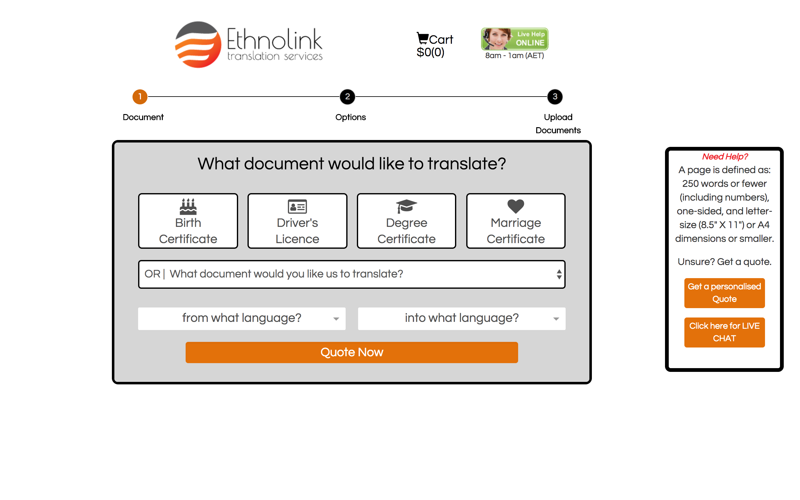
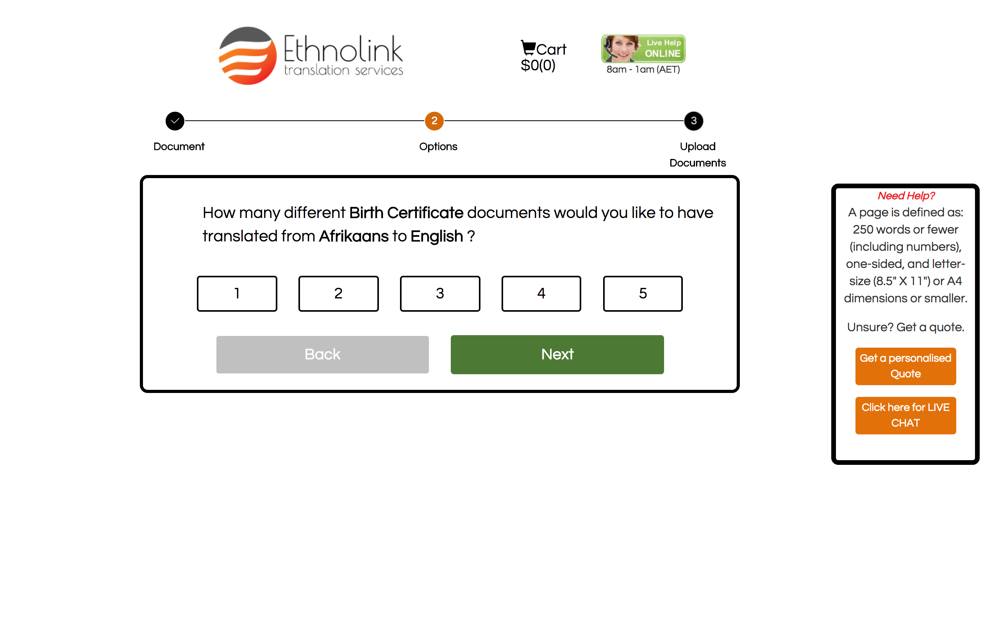
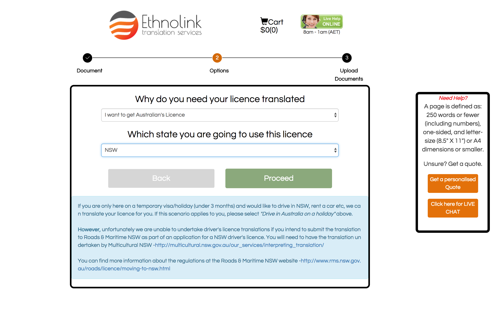
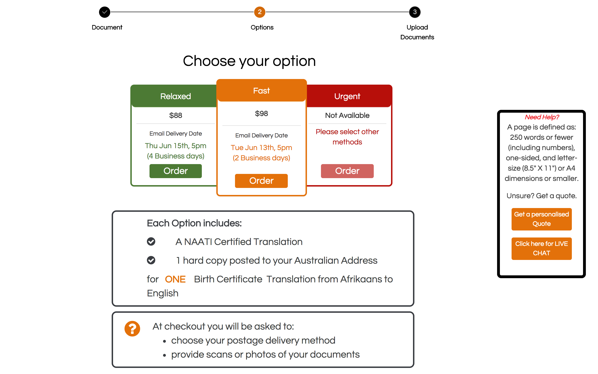
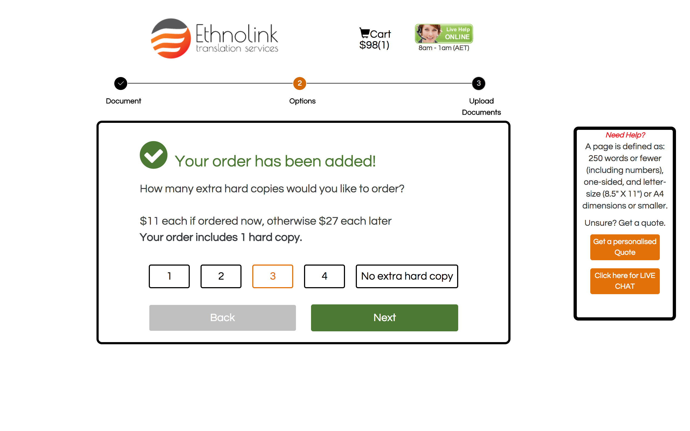
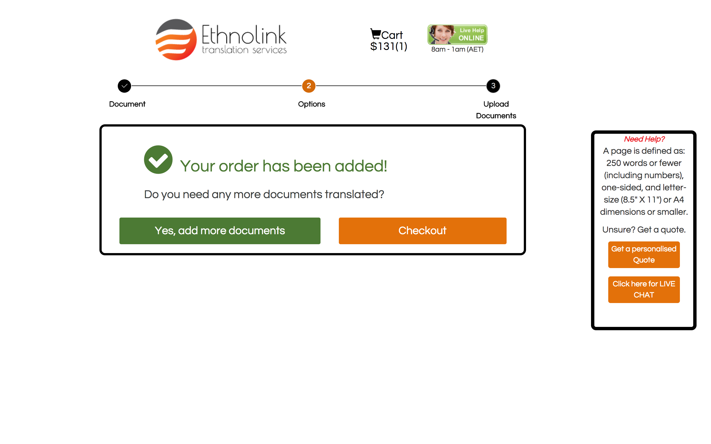
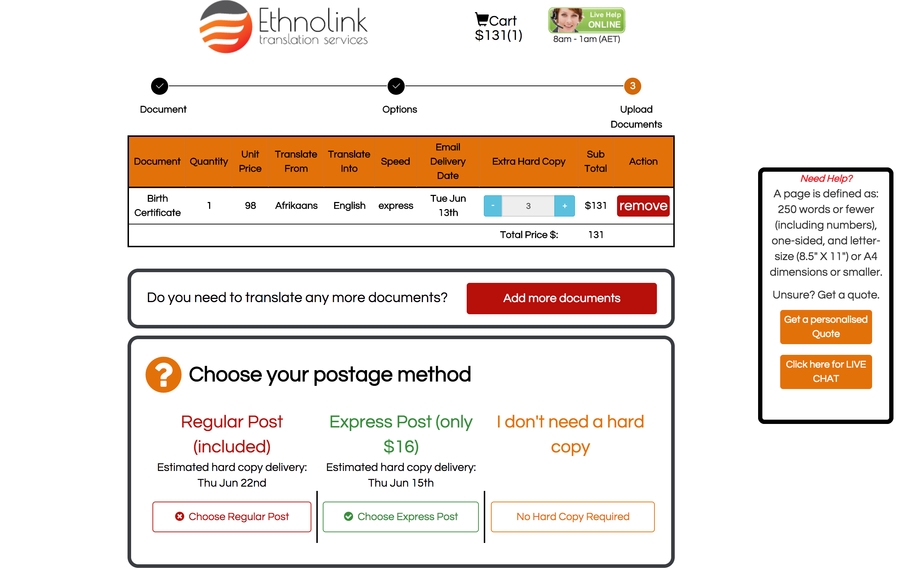
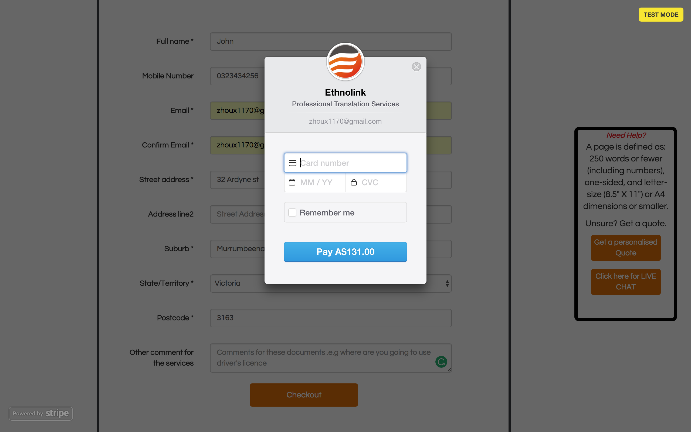

# React-Translation Service website
**The Website** develop functions such as

    •ordering translation services between diverse languages with different express methods
    •adding order to cart
    •uploading documents and making payment
    •online consultation 
    
**Features**  

    •React framework
    •responsive design (Bootstrap)

**The Web Server** utilizes Amazon Web Service(EC2, S3, Route53, Elastic Beanstalk)

**The Back-end** language utilizes Python.

# Screenshots of The Website
#### • `Website intial screen` 

#### • `Website example case of birthday certificate`

#### • `Website example case of drive's license`

#### • `Choose a plan with a specific express method`

#### • `Choose the number of hardcopies`

#### • `Add the order to cart`

#### • `Check the cart and Checkout`

#### • `Make a payment`

# License
   Copyright {2017} {Liangchen Zhou}
   
   Licensed under the Apache License, Version 2.0 (the "License");
   you may not use this file except in compliance with the License.
   You may obtain a copy of the License at
   
       http://www.apache.org/licenses/LICENSE-2.0
       
   Unless required by applicable law or agreed to in writing, software
   distributed under the License is distributed on an "AS IS" BASIS,
   WITHOUT WARRANTIES OR CONDITIONS OF ANY KIND, either express or implied.
   See the License for the specific language governing permissions and
   limitations under the License.
